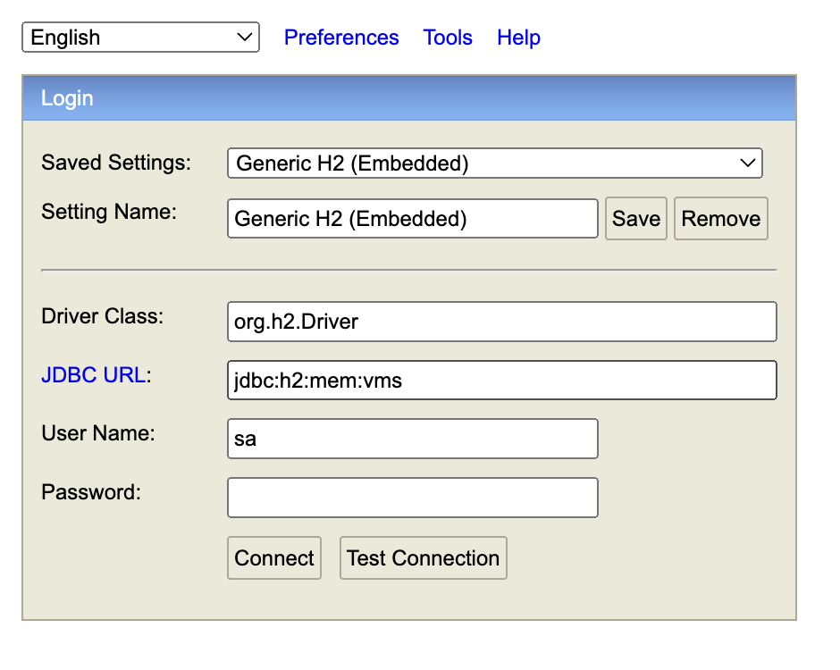
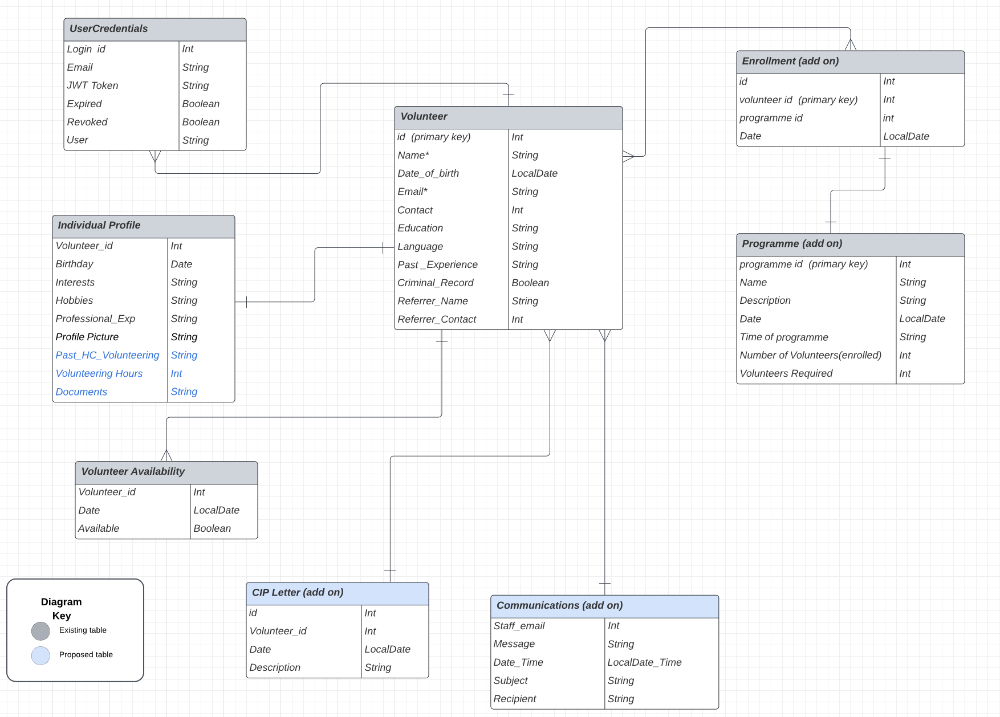
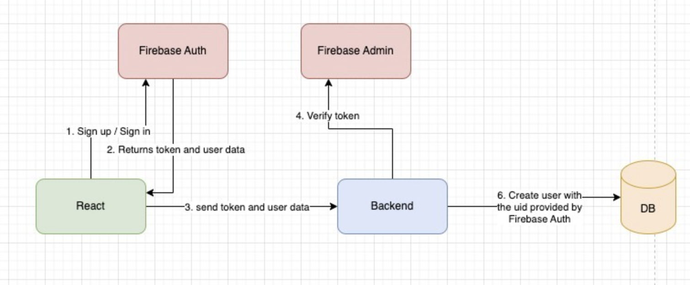
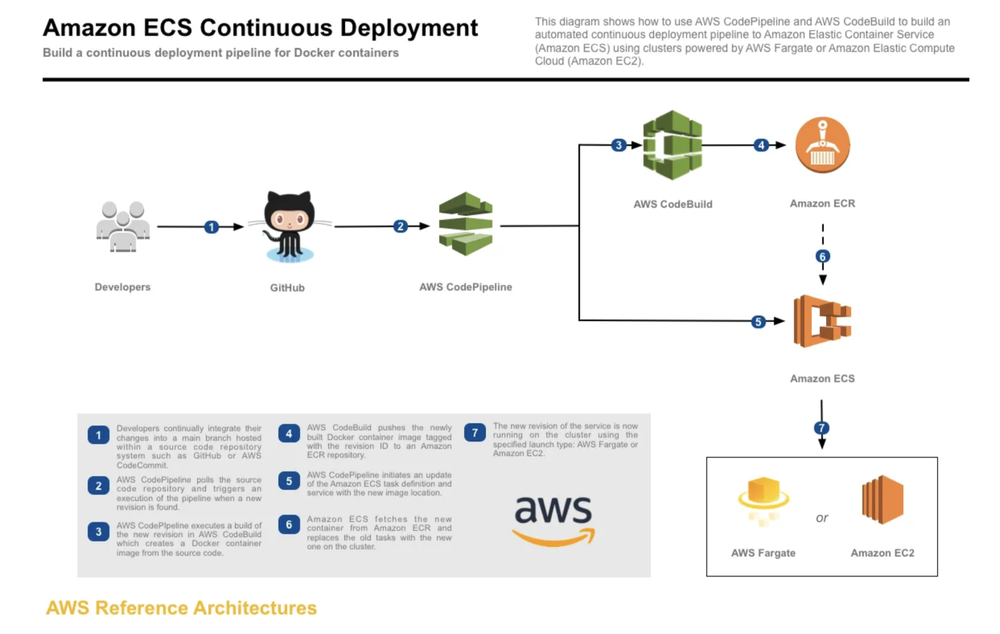

# Volunteer_Management_System_REST_API_Spring_Boot

## Steps to test the API Routes using Swagger

*** Control-click on any hyperlink to open a seperate tab on your browser

1. RUN < [docker run -p 8080:8080 goodwill80/vms-springboot:v1.0.1](#) > in command line. (PLEASE DO THIS FIRST!)
2. Go to https://delicate-kangaroo-fe57dd.netlify.app/ to generate a bearer token from Firebase, and copy the token to clipboard.
3. Go to http://localhost:8080/swagger-ui/index.html and paste the token in "Authorized" tab.
4. Proceed to test the routes.
5. H2 Database can be accessed via http://localhost:8080/h2

Required info(below) to connect H2

## Link to front-end (Demo)
Coming soon!
For frontend repository, refer to https://github.com/goodwill80/Volunteer_Management_System_VMS_Frontend

## Description
### App Summary
1. A full-stack digital platform for new volunteer signups along with a CRM dashboard to enable staff to administer new programs and enrol new volunteers.
2. This is a pro-bono project done to help a local charity organization to administer volunteers' signup, as well as manage its programs more efficiently. A simple process streamlining was performed to migrate some of the manual taskes commonly performed by staff to a digital platform.
3. Tech stacks - ReactJS with TypeScript, React Query, Tailwind CSS, Spring-Boot and Spring Security + Firebase Auth.
4. Deployment pipeline - GitHub, AWS code pipeline and AWS MySql RDS.
5. App in test environment (on port 8080) is using H2 in-memory database. 

### Relational Diagrams

### Authentication & Authorization Flow between front-end and backend
1. Firebase Auth for authentication and authorization.
2. Setup Security Filter Chain and Firbase filter to verify all requests which require JWT token.

### CICD Pipeline implemented
1. Github (Code Repository)
2. AWS Elastic Registry Service (Image Repository with vulnerability scan)
3. AWS Elastic Container Service - Fargate (with Load balancer and auto-scale)
4. AWS Paramerstore (Credential Management)
5. AWS CodePipeline (CodeBuild + Deploy)
6. AWS RDS MySQL (Database)

### Pipeline illustration 
image src: https://vtimd.medium.com/aws-codepipeline-the-good-and-the-bad-2bd607102c2

## Team Members

- [Jonathan](https://github.com/goodwill80 "jonathan's github")
- [Ace](https://github.com/acetay "ace's github")
- [Yingwang](https://github.com/shiywsg "yingwang's github")
- [Claire](https://github.com/clairetkw "claire's github")
